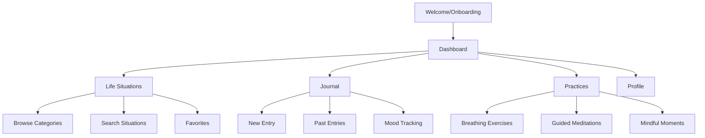

# Mindful Living: Daily Wellness App

<div align="center">
  
  
  
  
</div>

## 📱 Overview

**Mindful Living** is a comprehensive Flutter-based wellness application that provides practical guidance for life situations, mindfulness practices, and personal growth. Designed with a secular, evidence-based approach, it transforms wisdom into actionable insights for modern life.

### 🎯 Key Features
- **Life Situations Browser**: 1000+ scenarios with dual perspectives (Mindful + Practical)
- **Daily Wellness Dashboard**: Wellness score tracking, mood check-ins, progress streaks
- **Mindful Journal**: Private entries with mood tracking and gratitude prompts
- **Voice Assistant Integration**: Siri, Apple Watch, and conversational AI support
- **Guided Practices**: Breathing exercises, mindful moments, meditations
- **Multi-language Support**: English, Spanish, Hindi with RTL support

## 🏗️ Architecture

### 📂 Project Structure

```
lib/
├── app/                           # App-level configuration
│   ├── app.dart                   # Main app widget
│   └── theme/
│       └── app_theme.dart         # Material Design 3 theming
├── core/                          # Core business logic
│   ├── constants/
│   │   ├── app_colors.dart        # Brand color system
│   │   └── app_typography.dart    # Typography system
│   ├── managers/
│   │   └── localization_manager.dart # i18n management
│   ├── models/                    # Data models
│   │   ├── ai_models.dart
│   │   ├── favorite_item.dart
│   │   ├── life_situation.dart
│   │   └── user_profile.dart
│   └── services/                  # Business services
│       ├── ai_service.dart        # AI personalization
│       ├── favorites_service.dart # Favorites management
│       ├── voice_api_service.dart # Voice integration
│       └── voice_search_service.dart
├── features/                      # Feature modules
│   └── dashboard/
│       └── presentation/
│           └── pages/
│               └── dashboard_page.dart
├── shared/                        # Reusable components
│   ├── components/
│   │   ├── adaptive/             # Platform-specific adaptations
│   │   ├── base/                 # Base component classes
│   │   ├── buttons/              # Custom buttons
│   │   ├── cards/                # Card components
│   │   ├── forms/                # Form elements
│   │   ├── media/                # Media components
│   │   ├── navigation/           # Navigation elements
│   │   └── voice/                # Voice UI components
│   └── models/                   # Shared data models
├── generated/                     # Auto-generated files
│   └── l10n/                     # Localization files
└── firebase_options.dart         # Firebase configuration
```

### 🎨 Design System

#### Brand Colors
```dart
class AppColors {
  // Primary Brand Colors
  static const Color primaryBlue = Color(0xFF4A90E2);    // Trust, clarity
  static const Color growthGreen = Color(0xFF7ED321);    // Growth, harmony
  static const Color mindfulOrange = Color(0xFFF5A623);  // Energy, warmth
  
  // Neutral System
  static const Color textPrimary = Color(0xFF2C3E50);    // Main text
  static const Color textSecondary = Color(0xFF7F8C8D);  // Secondary text
  static const Color backgroundPrimary = Color(0xFFFAFBFC); // Main background
  static const Color backgroundCard = Color(0xFFFFFFFF); // Card backgrounds
}
```

#### Typography System
- **Primary**: Inter (clean, modern readability)
- **Secondary**: Poppins (friendly, approachable)
- **Scale**: Material Design 3 type scale with custom wellness-focused adjustments

### 🏛️ Architecture Patterns

#### 1. **Adaptive Brand-First UI Strategy**
- **85% Common Design**: Unified brand experience across platforms
- **15% Platform-Specific**: Native iOS/Android adaptations where beneficial
- **Material Design 3**: Primary design system with iOS adaptations

#### 2. **Component Architecture**
```dart
// Base component with common utilities
abstract class BaseComponent extends StatelessWidget {
  // Common spacing, colors, shadows
  static const double spacingXs = 4.0;
  static const double spacingS = 8.0;
  static const double spacingM = 16.0;
  // ... utility methods
}

// Mixins for common behaviors
mixin LoadingStateMixin { /* ... */ }
mixin ErrorStateMixin { /* ... */ }
mixin EmptyStateMixin { /* ... */ }
```

#### 3. **State Management**
- **Primary**: Provider + Riverpod for scalable state management
- **Local Storage**: Hive for offline-first data persistence
- **Remote Storage**: Firebase Firestore with real-time updates

#### 4. **Internationalization**
```yaml
# l10n.yaml
arb-dir: lib/l10n
template-arb-file: app_en.arb
output-localization-file: app_localizations.dart
```

## 🔥 Firebase Integration

### 🚨 CRITICAL SECURITY NOTICE

**IMPORTANT**: Firebase configuration files contain sensitive API keys and should NEVER be committed to version control.

#### Security Status
- ✅ Firebase config files are now excluded from git tracking
- ✅ `.gitignore` properly configured
- ⚠️ **IMPORTANT**: These files were previously tracked in git history and need to be rotated

#### Required Actions

**For New Team Members:**
1. Download configuration files from [Firebase Console](https://console.firebase.google.com/)
2. Place them in the correct locations (see `FIREBASE_SETUP.md`)
3. Verify files are NOT tracked: `git ls-files | grep -E "google-services|GoogleService-Info|firebase_options"`

**Required Files**:
- `android/app/google-services.json` (Android)
- `ios/Runner/GoogleService-Info.plist` (iOS)
- `lib/firebase_options.dart` (Flutter)
- `ios/firebase_app_id_file.json` (iOS additional config)

**For Project Administrators:**

Since these files were previously committed to git, they exist in the repository history. Consider:

1. **Rotate Firebase Keys** (Recommended):
   - Go to Firebase Console > Project Settings
   - Regenerate API keys or create new Firebase apps
   - Download new configuration files
   - Update local files

2. **Clean Git History** (Optional but recommended):
   - See [FIREBASE_SETUP.md](FIREBASE_SETUP.md) Section "Security Best Practices > Remove from Git History"
   - Use BFG Repo-Cleaner or git filter-branch to remove sensitive files from history
   - Coordinate with team before rewriting history

**DO NOT** commit these files to git. See [FIREBASE_SETUP.md](FIREBASE_SETUP.md) for complete setup instructions.

### Project Configuration
- **Project ID**: `hub4apps-mindfulliving`
- **Bundle ID**: `com.hub4apps.mindfulLiving`
- **Database Region**: `us-central1` (optimal global performance)

### Services Used

#### 🗄️ Cloud Firestore
```javascript
// Security Rules
rules_version = '2';
service cloud.firestore {
  match /databases/{database}/documents {
    // Public read for life situations
    match /life_situations/{document} {
      allow read: if true;
      allow write: if request.auth != null;
    }
    
    // Private user data
    match /users/{userId} {
      allow read, write: if request.auth != null && request.auth.uid == userId;
    }
  }
}
```

#### 🔐 Authentication
- Email/Password authentication
- Anonymous authentication for guest users
- Social login (Google, Apple) ready for future implementation

#### 📊 Analytics & Crashlytics
- User behavior tracking
- Performance monitoring
- Crash reporting with automatic collection

#### 💬 Cloud Messaging
- Push notifications for mindfulness reminders
- Personalized content recommendations

#### ⚡ Cloud Functions
```typescript
// Example: AI Content Personalization
export const personalizeContent = functions.firestore
  .document('users/{userId}/interactions/{interactionId}')
  .onCreate(async (snap, context) => {
    // AI-powered content personalization logic
  });
```

## 🎨 UI/UX Wireframes & User Flow

### 📱 Main Navigation Flow



### 🎯 Key User Flows

#### 1. **Life Situation Discovery**
```
User Input → AI Analysis → Personalized Recommendations → Detailed Guidance → Action Steps
```

#### 2. **Daily Wellness Check-in**
```
Mood Selection → Reflection Prompts → Wellness Score Update → Personalized Insights
```

#### 3. **Voice Assistant Interaction**
```
Voice Command → Intent Recognition → Content Retrieval → Audio Response → Follow-up Actions
```

### 📲 Screen Designs

#### Dashboard Screen
- **Wellness Score Circle**: Animated progress indicator
- **Quick Actions**: 4-grid layout for primary features
- **Daily Reflection**: Contextual prompts
- **Recent Activity**: Personalized content feed

#### Life Situations Screen
- **MindfulCard Components**: Swipeable cards with AI insights
- **Category Filters**: Horizontal scrolling chips
- **Search Integration**: Voice and text search
- **Favorites Integration**: Quick access to saved content

#### Journal Screen
- **Entry Composer**: Rich text editor with mood tracking
- **Calendar View**: Visual progress tracking
- **Mood Analytics**: Charts and insights
- **Export Functionality**: Share and backup entries

## 🎙️ Voice Integration

### Supported Platforms
- **iOS**: Siri Shortcuts integration
- **Apple Watch**: Native watch app support
- **Conversational AI**: In-app voice assistant

### Voice Commands Examples
```
"Hey Siri, help me with work stress"
"Log my mood as happy"
"Start a breathing exercise"
"Show my wellness progress"
```

### Implementation
```dart
class VoiceAssistantWidget extends BaseComponent {
  // Animated sound visualization
  // Real-time transcription
  // Context-aware responses
  // Smart suggestions
}
```

## 🧪 Testing Strategy

### Test Coverage Areas

#### 1. **Unit Tests**
- Core business logic validation
- Data model serialization/deserialization
- Service layer functionality
- Utility functions

#### 2. **Widget Tests**
- Component rendering
- User interaction handling
- State management validation
- Accessibility compliance

#### 3. **Integration Tests**
- End-to-end user flows
- Firebase integration
- Voice assistant functionality
- Offline/online synchronization

#### 4. **UI/UX Testing**
- Cross-platform consistency
- Responsive design validation
- Animation performance
- Accessibility standards (WCAG 2.1)

### Performance Testing
- **Metrics Tracked**:
  - App startup time < 3 seconds
  - Screen transition animations 60 FPS
  - Memory usage optimization
  - Battery efficiency

## 🚀 Build & Deployment

### Development Commands

```bash
# Get dependencies
flutter pub get

# Run with hot reload
flutter run

# Code analysis
flutter analyze --fatal-infos

# Run tests
flutter test

# Format code
flutter format .

# Generate localization
flutter gen-l10n
```

### Build Commands

```bash
# Android APK (Debug)
flutter build apk --debug

# Android Bundle (Release)
flutter build appbundle --release

# iOS (Debug, no codesigning)
flutter build ios --debug --no-codesign

# Web deployment
flutter build web
```

### Firebase Deployment

```bash
# Login to Firebase
firebase login

# Deploy Cloud Functions
firebase deploy --only functions

# Deploy Firestore rules
firebase deploy --only firestore:rules

# Full deployment
firebase deploy
```

## 📋 Prerequisites

### Development Environment
- **Flutter SDK**: 3.35.3 or higher
- **Dart SDK**: 3.5 or higher
- **Xcode**: 16.4+ (for iOS development)
- **Android Studio**: Latest stable version
- **Firebase CLI**: Latest version

### Device Compatibility

#### Android
- **Minimum SDK**: 21 (Android 5.0 Lollipop)
- **Target SDK**: 34 (Android 14)
- **Architecture**: armeabi-v7a, arm64-v8a (covers 98% of Indian devices)
- **Features**: MultiDex support for legacy devices

#### iOS
- **Minimum Version**: iOS 13.0
- **Architecture**: arm64 (iPhone 6s and later)
- **Features**: Universal app support

## 🔧 Configuration

### Environment Setup

1. **Clone the repository**
```bash
git clone <repository-url>
cd MindfulLiving/app
```

2. **Install dependencies**
```bash
flutter pub get
```

3. **Firebase setup**
```bash
# Install Firebase CLI
npm install -g firebase-tools

# Login to Firebase
firebase login

# Initialize project
firebase init
```

4. **Generate required files**
```bash
# Localization files
flutter gen-l10n

# Code generation
flutter packages pub run build_runner build
```

### Configuration Files

#### `firebase_options.dart`
Auto-generated Firebase configuration for Flutter

#### `android/app/google-services.json`
Android Firebase configuration

#### `ios/Runner/GoogleService-Info.plist`
iOS Firebase configuration

#### `l10n.yaml`
Internationalization configuration

## 📊 Analytics & Monitoring

### Key Metrics Tracked
- **User Engagement**: Session duration, feature usage
- **Content Performance**: Most accessed life situations
- **Wellness Progress**: Mood trends, practice completion
- **Technical Performance**: Crash rates, load times

### Privacy Compliance
- **GDPR Compliant**: EU data protection regulations
- **CCPA Compliant**: California privacy laws
- **Data Minimization**: Only collect necessary data
- **User Control**: Export and deletion capabilities

## 🤝 Contributing

### Code Style
- Follow [Effective Dart](https://dart.dev/guides/language/effective-dart) guidelines
- Use provided `.analysis_options.yaml` configuration
- Maintain 80+ character line length where reasonable
- Document public APIs with dartdoc comments

### Commit Guidelines
```
type(scope): description

🐛 fix(auth): resolve login state persistence
✨ feat(voice): add Siri shortcuts integration
📝 docs(readme): update Firebase setup instructions
🎨 style(ui): improve card component animations
♻️ refactor(core): optimize data service architecture
```

### Pull Request Process
1. Feature branch from `main`
2. Comprehensive testing
3. Documentation updates
4. Code review approval
5. Automated CI/CD validation

## 📄 License

This project is licensed under the MIT License - see the [LICENSE](LICENSE) file for details.

## 🆘 Support

For support, feature requests, or bug reports:
- **Issues**: [GitHub Issues](link-to-issues)
- **Discussions**: [GitHub Discussions](link-to-discussions)
- **Email**: support@mindful-living.app

---

<div align="center">
  <p><strong>Building mindful technology for human flourishing</strong></p>
  <p>Made with ❤️ using Flutter & Firebase</p>
</div>
